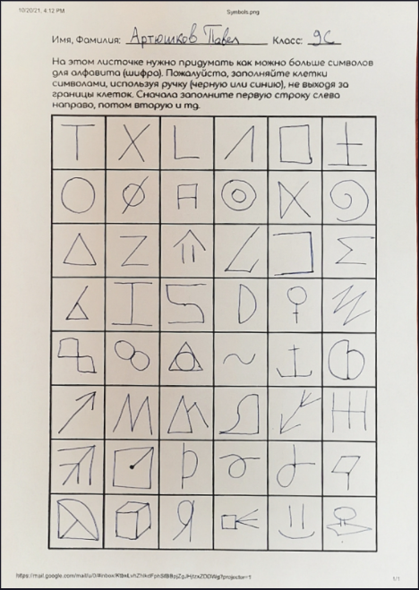
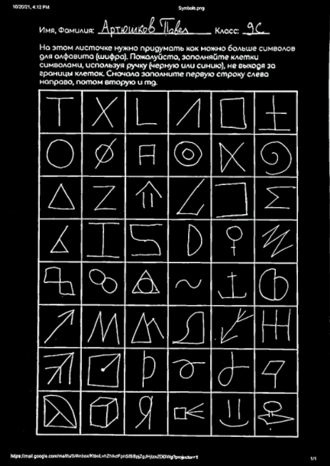
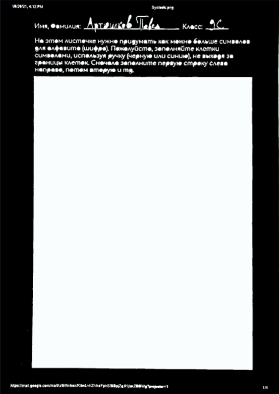
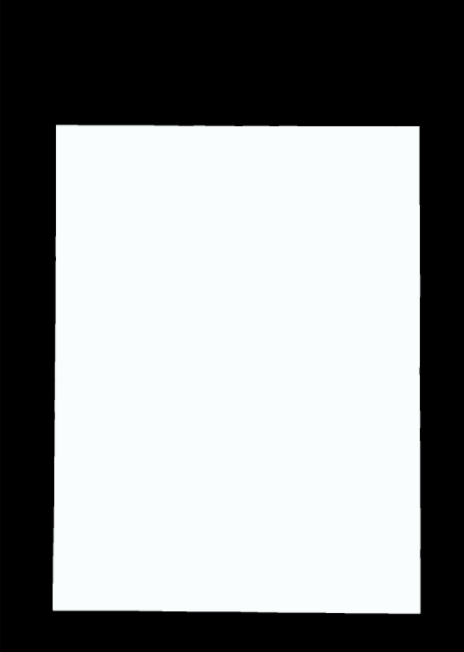
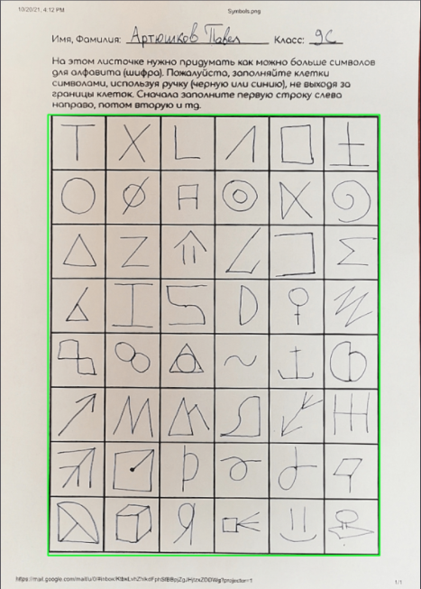
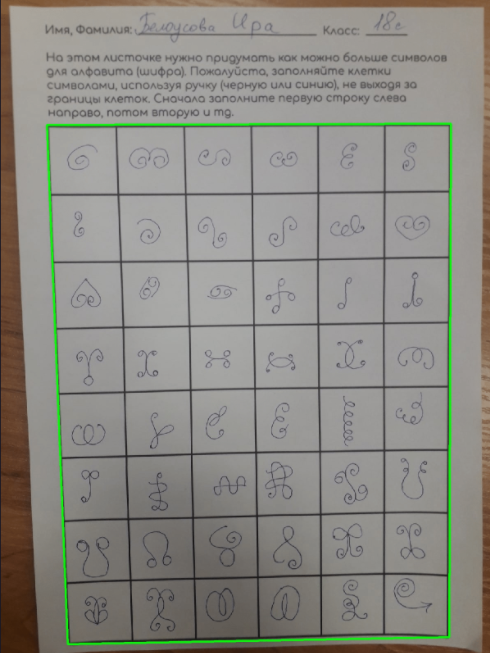
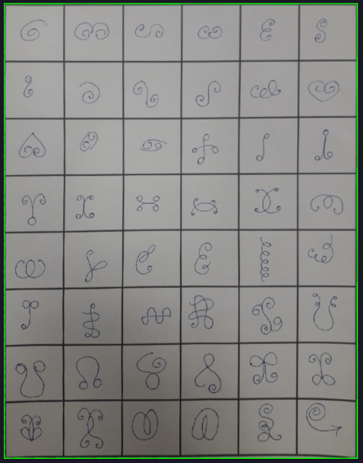
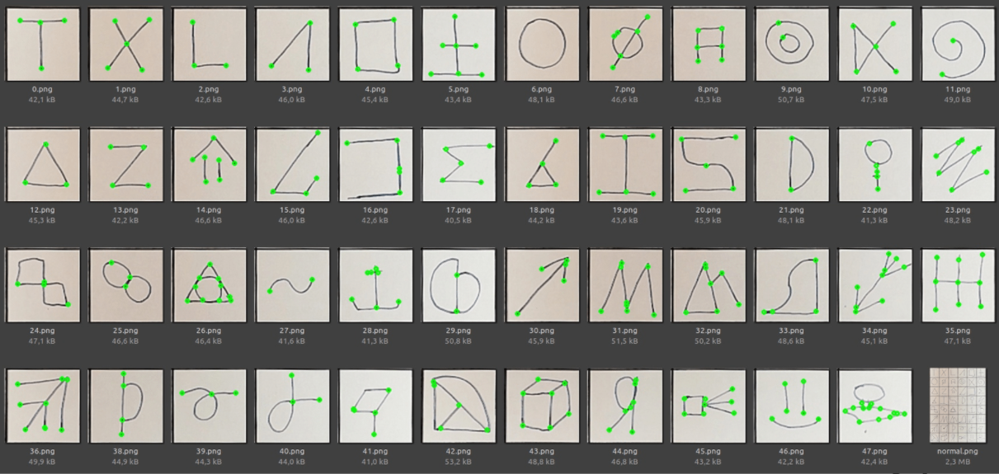

# SymbolsAnalyse

_This version of repository is now archived. I'm currently working on the next version._

## The goal
My goal is to create an easy tool for symbol analytics, because currently all works on the topic of language structureas and artificial alphabets are done fully manual. In this repository I tried converting each indivudual symbol to graph by counting number of branches from each point. This method came out being not too stable and universal.
So now I'm working on the next idea: using image vectorising techniques I'm converting all symbols to a set of arches, and then count a number of strikes in the symbol.

## Symbol parsing

  
  
  
  

  
## Found main symbol area

## Warp image if not perfect

  
  

## Result

